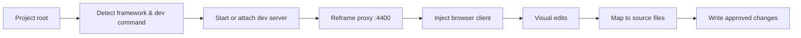

<div align="center">

# Reframe

> **The browser becomes an intelligent visual interface for the real codebase.**

Visual development for local web projects — edit the running site in the browser, write changes to real source files.

[](https://nodejs.org/)
[](https://www.typescriptlang.org/)
[](https://docs.npmjs.com/cli/v10/using-npm/workspaces)
[](https://playwright.dev/)
[](https://vitest.dev/)
[](.github/workflows/ci.yml)
[](https://openai.devpost.com)

</div>

---

## About

Reframe is an AI-native visual development environment for **local** web projects. Run `npx reframe` in your project folder and Reframe detects your framework, starts or attaches to your dev server, injects an editing UI through a local proxy, and opens the site in your browser — no browser extension, VS Code extension, or proprietary IDE required.

The rendered page is the editing surface; **your repository remains the source of truth**. Select an element, resize or restyle it, describe structural changes in natural language, preview alternatives in Explore Mode, and approve edits that persist to the correct source files. Reframe maps DOM nodes back to components and files, sends structured context to Codex (not just a CSS selector), and records visual history with screenshots and local Git checkpoints so every accepted change is reviewable and reversible.

Unlike design tools that produce mockups, or AI generators that spin up isolated sandboxes, Reframe sits **inside your existing workflow**: your dev server, hot reload, routing, and Git history all stay intact. Reframe is the translation layer between what you see in the browser and maintainable changes in your codebase.

---

## Why Reframe?

Most UI tools fall into two camps: **design canvases** that never touch your repo, or **AI generators** that write new files in a separate environment. Reframe is built for developers who already have a project running locally and want visual editing without losing the connection to source code, design rules, and version control.

| Capability | Figma / design tools | AI UI generators (v0, Bolt, Claude artifacts) | Reframe |
| --- | :---: | :---: | :---: |
| Edits your running local app | No | No — separate sandbox or new project | **Yes** |
| Uses your dev server and HMR | No | No — own environment | **Yes** |
| Maps selections to existing source files | No | Generates new files, not your app | **Yes** (supported frameworks) |
| Writes approved changes to your repo | No | Exports or copies code manually | **Yes** (supported frameworks) |
| Preserves project design system | Manual handoff | Often invents new styles | **Design DNA** — detected tokens, components, and rules |
| AI gets structured browser + repo context | N/A | Prompt + screenshot at best | **Element Context Packets** — component, source location, Design DNA, errors |
| Visual history tied to real checkpoints | Version history on mockups | Limited or session-only | **Visual Time Machine** — screenshots, prompts, files, Git checkpoints |
| Preview without touching source | Yes | Yes | **Explore Mode** |
| No browser extension required | N/A | Varies | **Yes** — local proxy injection |
| Requires your codebase | No | No | **Yes** — by design |

**Framework honesty:** Reframe fully supports source writes for React + Vite, React + Vite + TypeScript, vanilla HTML/CSS, and Laravel (Vite assets; Blade read-only). Next.js, Nuxt, Vue, Svelte, Angular, and Astro are **preview-only** today — you can inspect, explore, and use visual history, but source writes are not yet reliable for those stacks.

---

## Ideal for

- Frontend and full-stack developers iterating on a local dev server who want direct visual feedback without leaving the codebase
- Teams where designers and developers need comments and edits anchored to **real components**, not stale mockups
- Hackathon and prototype workflows — one command, real files, reversible changes
- Codex users who want repository-aware, design-system-aware context instead of one-off generation
- Anyone maintaining a component library or design system who needs edits to respect existing tokens and patterns

---

## Table of Contents

- [About](#about)
- [Why Reframe?](#why-reframe)
- [Ideal for](#ideal-for)
- [Features](#features)
- [Tech Stack](#tech-stack)
- [Architecture](#architecture)
- [Installation](#installation)
- [Quick Start](#quick-start)
- [Usage](#usage)
- [CLI Reference](#cli-reference)
- [Development](#development)
- [Requirements](#requirements)

---

## Features

- **Visual editing** — select elements, resize and restyle them, and describe structural changes in natural language.
- **Source mapping** — link DOM elements to real source locations; show mapping confidence (exact, probable, ambiguous) before writing.
- **Direct Edit + Codex Edit** — deterministic style and layout changes locally; structural changes through Codex with review before accept.
- **Explore Mode** — experiment in the browser without modifying source files until you choose to implement.
- **Design DNA** — analyze and persist the project's design language (tokens, components, rules) for consistent edits and AI context.
- **Visual Time Machine** — screenshot-first history with prompts, changed files, and local Git checkpoints; restore any accepted state.
- **Framework detection** — auto-detect project type from `package.json`, config files, and directory layout.
- **No extension** — runs through a local proxy; your app source stays untouched until you approve a change.

## Tech Stack

| Layer | Package | Role |
| --- | --- | --- |
| CLI | `reframe` | Entry point — detect project, start proxy, open browser |
| Dev server | `@reframe/dev-server` | Proxy, WebSocket server, source mapping, history, AI edits |
| Browser client | `@reframe/browser-client` | Injected toolbar and visual editing UI |
| Shared | `@reframe/shared` | Protocol types and utilities |

**Runtime:** TypeScript, Node.js 22+, Playwright (browser automation), `@openai/codex` (AI).

**Monorepo workspaces:** `packages/*` (core) and `demo/*` (sample projects).

### Supported frameworks

Reframe auto-detects the project from `package.json`, config files, and directory layout.

| Framework | Source writes |
| --- | --- |
| React + Vite | Yes |
| React + Vite + TypeScript | Yes |
| Vanilla HTML/CSS | Yes |
| Laravel (Vite assets) | Yes (Blade read-only) |
| Next.js, Nuxt, Angular, Astro, Vue, Svelte, SvelteKit | Preview only |

Override detection with `--framework` when needed.

---

## Architecture



1. **Detect** — scan the project root for framework, package manager, and dev script.
2. **Attach** — start the project's dev server or connect to one already running.
3. **Proxy** — serve the app through Reframe at `http://127.0.0.1:4400`.
4. **Inject** — add the browser client (toolbar, selection, edit panel) without modifying your app code.
5. **Map & write** — link DOM elements to source locations; approved edits persist to disk.

Press `Ctrl+C` to stop Reframe and every server it owns.

---

## Installation

### From source

```bash
git clone https://github.com/Xrnozy/Reframe.git
cd reframe
npm install
npm run build
npm run pack:cli
```

This writes a `reframe-0.0.0.tgz` package. Install it locally or globally:

```bash
# Local install in a project
npm install /path/to/reframe-0.0.0.tgz

# Global install
npm install -g /path/to/reframe-0.0.0.tgz
```

---

## Quick Start

```bash
# Build Reframe once from the repo root
npm install
npm run build
npm run pack:cli
npm install -g ./reframe-0.0.0.tgz

# Run against a demo project
cd demo/react-demo
npm install
npx reframe
```

Other demos: `demo/vanilla-demo` (plain HTML/CSS), `demo/react-tailwind-demo` (React + Tailwind).

---

## Usage

### Run in your own project

```bash
cd /path/to/your-project
npx reframe
```

Reframe opens the injected proxy in your browser. Common options:

```bash
# Attach to an already-running dev server
npx reframe --url http://127.0.0.1:5173

# Override the dev command
npx reframe --dev-cmd "npm run dev"

# Set framework explicitly
npx reframe --framework react-vite-typescript

# Change the Reframe proxy port (default 4400)
npx reframe --port 4400
```

### AI authentication

Local AI mode uses your existing Codex login — no API key required:

```bash
codex login          # if not already signed in
npx reframe auth     # show auth status
```

Optional API fallback:

```bash
export REFRAME_AI_PROVIDER=api   # Windows: set REFRAME_AI_PROVIDER=api
npx reframe auth api
npx reframe auth logout
```

Set `REFRAME_CODEX_PATH` if the `codex` binary is not on your PATH.

### Design DNA

Analyze and persist a project's design language from the project root:

```bash
npx reframe dna preview
npx reframe dna write --correct=color:ID --exception=spacing:ID
npx reframe dna status
```

Add `--agents` to `dna write` to update the Design System section in the project's `AGENTS.md`.

---

## CLI Reference

### Commands

| Command | Description |
| --- | --- |
| `reframe` | Detect project, start proxy, open browser |
| `reframe auth` | Show Codex auth status |
| `reframe auth api` | Store OpenAI API key (optional fallback) |
| `reframe auth logout` | Remove stored API credential |
| `reframe dna preview` | Analyze design tokens and components (read-only) |
| `reframe dna write` | Persist reviewed Design DNA findings |
| `reframe dna status` | Show current Design DNA version |

### Flags and environment

| Flag / variable | Description |
| --- | --- |
| `--url <url>` | Attach to a running dev server (`REFRAME_DEV_URL`) |
| `--dev-cmd <cmd>` | Override the dev start command (`REFRAME_DEV_CMD`) |
| `--framework <name>` | Force framework detection |
| `--port <n>` | Reframe proxy port (`REFRAME_PORT`, default `4400`) |
| `REFRAME_CODEX_PATH` | Path to the `codex` binary |
| `REFRAME_AI_PROVIDER` | Set to `api` for direct OpenAI API transport |

Framework values: `react-vite`, `react-vite-typescript`, `next`, `nuxt`, `angular`, `astro`, `vue`, `svelte`, `sveltekit`, `laravel`, `vanilla`.

---

## Development

### npm scripts (repo root)

| Script | Description |
| --- | --- |
| `npm run build` | Compile all TypeScript packages |
| `npm run clean` | Remove build artifacts |
| `npm run pack:cli` | Build and pack the `reframe` CLI as `.tgz` |
| `npm run test:unit` | Unit tests |
| `npm run test:integration` | Integration tests |
| `npm run test:e2e` | Playwright end-to-end tests |
| `npm run verify:pack` | Verify CLI package integrity |
| `npm run verify:fixtures` | Verify demo fixture manifests |
| `npm run verify:leaks` | Check for orphaned processes/ports |
| `npm run test:phase0` … `test:phase12` | Phase-scoped test suites |

---

## Requirements

- **Node.js** `>=22` and `<25`
- A supported local web project with a dev server (or static `index.html` for vanilla)

---

<div align="center">

Built for [OpenAI Build Week](https://openai.devpost.com)

</div>
